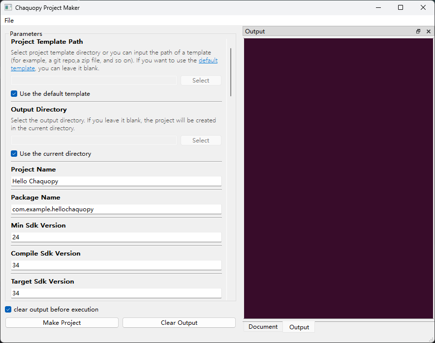

# Chaquopy Project Maker

This is a tool to help you create a new Chaquopy-based Android Studio project quickly.

---
> Chaquopy provides everything you need to include Python components in an Android app, including:
> - Full integration with Android Studio’s standard Gradle build system.
> - Simple APIs for calling Python code from Java/Kotlin, and vice versa.
> - A wide range of third-party Python packages, including SciPy, OpenCV, TensorFlow and many more.

The project configuration process is a little bit complicated and tedious, so I make this tool to make it easier.

This tool uses cookiecutter to do the project generation, and the default cookiecutter template is distributed as a git 
submodule which can be found [here](https://github.com/zimolab/HelloChaquopy).

This tool is a GUI program, and it uses [PyGUIAdapter](https://github.com/zimolab/PyGUIAdapter) to make the GUI.

You can also make your own cookiecutter template from the default one. Just don't forget to including the following 
configs in your own template's `cookiecutter.json`. 

```json
{
  "project_name": "Hello Chaquopy",
  "project_slug": "{{ cookiecutter.project_name.title().replace(' ', '') }}",
  "package_name": "com.example.{{ cookiecutter.project_slug.lower() }}",
  "source_path": "{{ cookiecutter.package_name.replace('.', '/') }}",
  "min_sdk": 24,
  "compile_sdk": 34,
  "target_sdk": 34,
  "abi_arm64_v8a": true,
  "abi_armeabi_v7a": true,
  "abi_x86": true,
  "abi_x86_64": true,
  "agp_version": "8.3.1",
  "kgp_version": "1.9.23",
  "chaquopy_version": "15.0.1",
  "gradle_wrapper_url": "https://services.gradle.org/distributions/gradle-8.4-all.zip",
  "java_source_compatibility": "VERSION_1_8",
  "java_target_compatibility": "VERSION_1_8",
  "jvm_target": "1.8",
  "python_version": "3.8",
  "python_product_flavors": "{{ 'py' + cookiecutter.python_version.replace('.', '').strip() }}",
  "python_command": "",
  "pyc_src": [
    "Auto",
    "False",
    "True"
  ],
  "pyc_pip": [
    "Auto",
    "False",
    "True"
  ],
  "pyc_stdlib": [
    "Auto",
    "False",
    "True"
  ],
  "python_source_set": {
    "name": null,
    "src_dir": null
  },

  "pip": {
    "index_url": "",
    "extra_index_urls": [],
    "requirements": []
  },

  "static_proxy": {
    "classes": []
  },
  "extract_packages": {
    "packages": []
  },

  "maven_repos": {
    "plugin": [],
    "dependency": []
  },
  "extra_configs": {},

  "_copy_without_render": [
    "gradlew",
    "gradlew.bat",
    "gradle-wrapper.jar"
  ]
}
```

---

## How to use

A pre-built executable (Using pyinstaller) for Windows is provided currently, you can download it from the release page.

The GUI is pretty simple and straightforward.




---


For other platforms, you can clone the repository and run it from the command line:

```commandline
$ git clone --recurse-submodules https://github.com/zimolab/chaquopy-project-maker.git
```

install the dependencies:
```commandline
$ cd chaquopy-project-maker
$ poetry install
```

(activate the virtual environment and) run the `main.py` file:
```commandline
$ python chaquopy_project_maker/main.py
```

Or you can use pyinstaller to make your own executable. Check the [ChaquopyProjectMaker.spec](ChaquopyProjectMaker.spec)
for reference.

---
